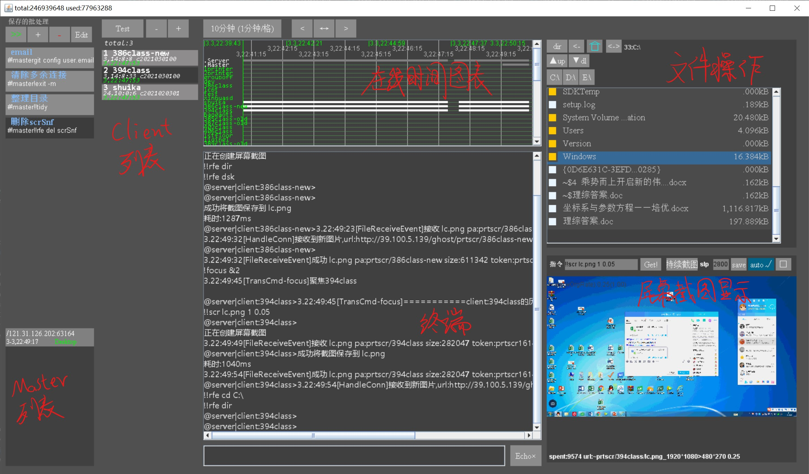
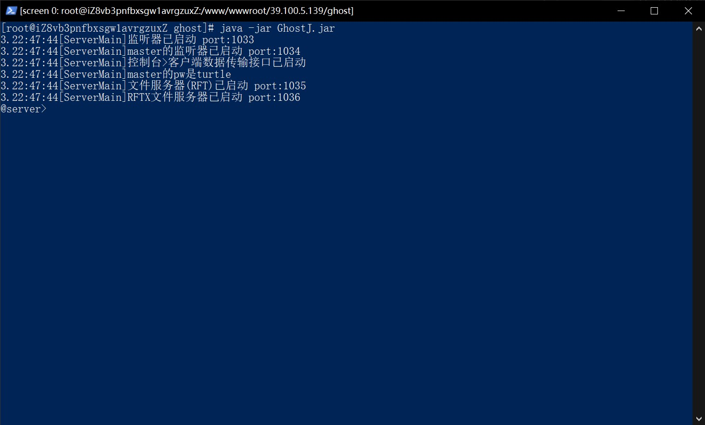
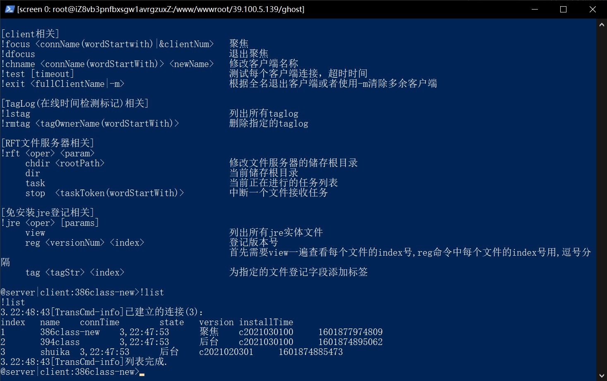

# GhostJ

## 说明
GhostJ实现了实时执行指令、截图、文件操作、鼠标键盘控制、操作监控等功能 

* 此项目架构较为复杂，可读性较差

## 声明

使用此类代码进行未经允许的远程控制属于违法行为，本项目及作者不向违法行为提供任何支持

## 联系方式

问题发至issue
讨论细节邮件至1010553892@qq.com或QQ联系

## 依赖

- `fastjson` 阿里巴巴的json解析类库
- `RFT` 自己开发的文件上传类库 可在主页找到开源仓库
- `RFTX2` 自己开发的文件双向传输类库 可在主页找到开源仓库

## 分支

- `master` 正在开发的主分支
- `classic` 重构服务端之前的经典服务端代码

## 目录结构

- `src` 源代码
- `libs` 依赖库

## 项目结构

### 主要包

- `com.ghostj.client` 客户端主程序，被控端
- `com.ghostj.master` 主控端程序，javaSwing开发的可视化操作桌面程序
- `com.ghostj.server_old` 服务端程序，处理客户端和主控端的连接、管理文件、转发消息等功能
- `com.ghostj.util` 通用的类和方法

### client

已使用策略模式重构

- `cmd` 命令处理逻辑的model(独立出来的代码见 https://github.com/rockchinq/rcp)
- `conn` 建立并管理客户端到服务端的连接
- `core` 客户端的启动类，包含命令行执行线程类、控制命令解析类
- `func` 所有客户端支持的控制指令，由Processor类解析控制指令并调用
- `util` 客户端实用类

*注意：此处`控制命令`(指客户端收到的由主控端或服务端发出的控制指令)有别于`命令行的命令`(将被cmd.exe执行的指令)  
      事实上，客户端执行命令行指令的逻辑也被归类为一个控制指令

#### 执行逻辑
被启动后，启动HandleConn线程，尝试建立与服务端的连接，堵塞接收指令解析并执行。  
当检测到连接断开后，重新尝试连接

### master

有待重构，目前可读性很低

- `conn` 管理与服务端的连接
- `core` 批处理类和模拟控制台的缓冲区
- `gui` 管理所有界面
- `util` 实用类

### server

服务端代码有待重构，目前未使用设计模式来构建服务端代码。可读性很低

## 指令说明

GhostJ平台有两种级别的指令:Server级别、Client级别  
Server级别的由单个半角惊叹号(!)开始,Client级别的由两个半角惊叹号(!!)开始  

* 可以直接在运行Server的控制台输入指令并回车执行
* 或者在Master底端的文本框输入并回车执行
* Master传到Server的指令无法识别的,将直接发到当前被聚焦的Client

### Server级别

以下指令均运行于Server,实现代码详见server包的TransCmd类

#### !help

- 输出指令列表
- 使用此指令输出的命令列表不完整
- 详见TransCmd.java

#### !list

- 输出在线客户端列表

#### !echo \<Message>

- 输出`Message`
- 所有在线Master均可见

#### !pw \<NewPassword>

- 修改Master连接Server的密码为`NewPassword`

#### !focus \<Client>

- 聚焦到指定客户端
- Client为`目标客户端的名称`或`&+客户端编号`
- e.g. 聚焦到名称为`test`、编号为`3`的客户端:`!focus test`或`!focus tes`或`!focus &3`

#### !dfocus

- 取消聚焦
- 若是改变聚焦目标,可直接focus到新目标,无需dfocus目前目标

#### !test [TimeOut]

- 测试所有客户端的在线状态
- 并断开意外断连的客户端
- `TimeOut`为客户端响应超时时间,毫秒,未指定时默认为200毫秒

#### !chname \<Client> \<NewName>

- 修改客户端名称
- `Client`指定客户端,修改其名称为`NewName`

#### !lstag

- 列出所有已记录的`TagLog`名称
- `TagLog`是用于记录客户端在线时间的功能

#### !rmtag \<tagName>

- 删除tag名称为`tagName`的所有在线时间记录

#### !lsmst

- 列出所有当前在线Master的列表
- 此消息所有Master可见

#### !rft \<chdir|dir|task|stop> \<params>

- RFT是管理GhostJ平台中传输文件的指令
- `!rft chdir <NewPath>`修改RFT接收的文件储存目录为`NewPath`
- `!rft dir`输出当前RFT接收的文件储存目录
- `!rft task`输出当前RFT正在接收的文件列表
- `!rft stop <TaskIndex>`中断指定的传输任务

#### !jre \<view|reg|tag|rmtag>

- 管理免安装JRE登记表
- 此登记表需结合安装器使用,见GhostPioneer项目

#### !note \<Message>

- 设置新note,在Master登录时会向Master发送此Message

#### !exit \<-m|-a|-lv|ClientName>

- 通知客户端退出并断开客户端连接
- `!exit -m`退出名称相同的更靠后的客户端
- `!exit -a`退出所有客户端
- `!exit -lv`退出相同名称的客户端中版本较低的连接
- `!exit <ClientName>`退出指定名称的客户端,此处名称必须为完整名称

#### !hst

- `!hst`输出近期Server输出记录

#### !log \<flush|len>

- `!log flush`刷新日志缓冲区
- `!log len`输出日志缓冲区大小及已占用大小

#### !all \<Content>

- 向所有客户端发送`Content`

#### !ban \<add|ls> \<params>

- 封禁
- `!ban add <Address>`封禁来自`Address`的所有连接
- `!ban ls`列出所有封禁地址

#### !startup [rm|Content]

- 操作客户端连接上Server时发送给Client的指令
- `!startup`查看目前指令
- `!startup rm`删除指令
- `!startup <Content>`设置指令为`Content`

#### !stop

关闭服务端

### Client级别

以下指令均运行于Client,其实现代码详见client包中的func包

#### !!audio [Length]

- 录音并上传到Server
- `Length`为录音时长毫秒,未指定时设置为5000

#### !!bat \<reset|add|view|run> [params]

- Client提供一个储存指令的缓存
- `!!batch reset`清除缓存
- `!!batch add <Content>`在缓存中追加一行内容<Content>
- `!!batch view`输出缓存中所有指令
- `!!batch run`逐行运行缓存中的指令

#### !!cfg \<ls|write|set|rm> \<params>

- 管理客户端的配置文件,操作不当可能导致断连
- `!!cfg ls`列出客户端所有配置字段
- `!!cfg write`将运行时修改的配置字段写入配置文件
- `!!cfg set <Field> <Value>`设置运行时中的配置字段`Field`为`Value`
- `!!cfg rm <Field>`删除字段
- set和rm之后需要执行write才能写入文件,否则重启客户端之后将丢失修改结果

#### !!exit \<ClientName>

- 退出客户端
- `ClientName`必须为客户端完整名称

#### !!gget \<URL> \<SavePath> \<SaveName>

- http下载器
- 将`url`的文件下载到目录`SavePath`,重命名为`SaveName`

#### !!help

- 输出客户端指令帮助

#### !!info

- 运行时信息

#### !!kmr \<mouse|key> \<params>

- 控制鼠标和模拟键盘输入

#### !!proc \<focus|ls|bg|new|disc> \<params>

- 管理客户端上启动的子进程
- `!!proc ls`列出所有子进程
- `!!proc new [Name] [Command]`新建名为`Name`的子进程并执行命令`Command`并聚焦到此子进程,若未设置命令则执行`cmd`
- `!!proc bg [Name] [Command]`新建子进程并执行命令,但不聚焦到此子进程
- `!!proc focus <ProcessName>`聚焦到名称以`ProcessName`开头的子进程,之后Client收到的来自Server的内容都将发送到Process中
- `!!proc disc <ProcessName>`断连名称以`ProcessName`开头的子进程,此操作并不会停止目标子进程,且Client之后将无法操作此子进程

#### !!scr \<params>

- 屏幕截图并发送到Server
- `!!scr <FileName>`全屏截图并储存到文件
- `!!scr <FileName> <ResolutionCompressRate>`全屏截图并进行分辨率压缩(范围0.0-+∞)然后储存到文件
- `!!scr <FileName> <ResolutionCompressRate> <ColorCompressRate>`全屏截图并进行分辨率压缩(范围0.0-+∞),进行颜色压缩(范围0.0-1.0),然后储存到文件
- `!!scr <FileName> <ResolutionCompressRate> <ColorCompresseRate> <Width> <Height> <XOnScreen> <YOnScreen> <ColorFormat>`  
      从屏幕坐标(x,y)为(`XOnScreen`,`YOnScreen`)的像素开始向右下角截图宽为`Width`长为`Height`的截图,并对图像的分辨率进行比率为`ResolutionCompressRate`(范围0.0-+∞)的压缩,  
      对图像色彩进行比率为`ColorCompressRate`(范围0.0-1.0)的压缩,使用编码为`ColorFormat`的颜色格式编码到文件`FileName`
- 每次截图之后都会自动上传到Server,除非命令第四个参数为`nosend`

#### !!rfe \<dir|cd|upload|download|dsk|del> \<params>

- 为GhostJ设计的文件浏览指令,详见client包中func包中的FuncRFE.java

#### !!rft upload \<FileOnClientHost> \<TargetPathOnServerHost>

- 使用文件传输库传输文件
- 将客户端本地的`FileOnClientHost`文件上传到Server主机上相对于Server上RFT根目录的路径`TargetPathOnServerHost`
- 设置Server上RFT的根目录参见!rft指令

#### !!reconn

- 使该客户端断连并尝试重新连接Server

#### !!startup [set|rm]

- 管理Client的启动任务,客户端将在每次启动时自动运行此任务
- `!!startup set <Content>`设置启动任务为`Content`
- `!!startup rm`删除启动任务